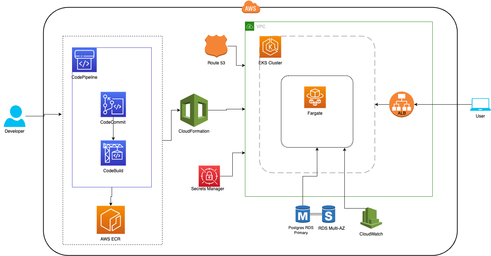

# Birthday Reminder App
## About the project
### Description
The Birthday Reminder application is a simple REST API that allows users to save and retrieve their birthday information. Users can update their username and date of birth (YYYY-MM-DD format), and the application counts down the days to their birthday or provides a personalized birthday message if the special day is today.

## Getting Started
The solution contains two Dockerfiles - one for PostgreSQL DB and the second one to bring up the Python app with Birthday API.
### For local deployment:
1. Create a docker network to allow communication between db and python containers
   ```
   docker network create db-app-network
   ```
2.  Bring up the DB
     ```
     docker build -t postgresdb ./psql-db
     docker run --name postgresdb --network db-app-network -d postgresdb
     ```
     This will bring up the container with a created database named "db"   
3. Bring up the Python app
   ```
   docker build -t bday-python-app ./birthday-reminder-app
   docker run -it --rm --name bday-python-app --network db-app-network bday-python-app
   ```
   This will bring up a container with started Python process that will process the API calls.

#### Testing
* Terminal 1
  Once you brought up Python container - you will see the log output of the application. Use it to catch API response codes.
* Terminal 2
  Log in to the Python app container
  ```
  docker exec -it bday-python-app /bin/sh
  ```
  And run the first PUT request to add a user
  ```
  curl -X PUT http://0.0.0.0:80/hello/username -H "Content-Type: application/json"  -d '{"name": "username","bday": "2000-07-15"}'
  ```
  If a user already exists, you will see 400 Error Response with the message that the user already exists. If request is correct and the user doesn't exist, you will get 200 Response and the user will be added to the db.
  Now you can get a birthday message:
  ```
  curl -X GET http://0.0.0.0:80/hello/username
  ```
  If the user is not found, in the logs will appear 404 User Not Found message. If it exists - the app will calculate day till the user's birthday or will wish a Happy Birthday is the day is today.

### Deployment to Cloud
#### AWS Deployment schema
The application can be deployed to AWS by this deployment schema

* **Amazon RDS with Multi-AZ deployment**: provides a highly available PostgreSQL database.
* **Application Load Balancer (ALB)**: distributes incoming traffic to our containers.
* **Route 53**: acts as the DNS service, routing traffic to the load balancer and providing health checks.
* **CloudWatch**: provides monitoring and logging capabilities for the application and infrastructure.
* **Secrets Manager**: securely stores application's sensitive credentials such as DB password.
* **EKS Cluster (Amazon Elastic Kubernetes Service)**: This is a managed Kubernetes service provided by AWS. It manages the deployment and scaling of worker nodes or pods that run Docker containers as a Fargate Task.
* **Fargate Task**: AWS Fargate runs a single Fargate task that directly hosts a Docker container running the Birthday Reminder application.

#### Deployment script to AWS

